# Tutorial for RaMap

This tutorial is intended to guide the application of RaMap. It provides a step-by-step instruction and demonstrates its use through the example Raman mapping dataset *Mapping_Large_02.csv*.

For more detailed information and explanations regarding the inputs and messages in Raman mapping, please refer to the official [documentation](documentation.md).

At the beginning, it should be checked whether all rerquired python packages are installed. Please refer to the [readme](README.md#Requirements) file for details.

## 1 Run the script

## 2 Import the Raman data
### Load Raman Mapping File

* After executing the script [RaMap.py](RaMap.py), a file explorer window will open.
  Use this window to select the Raman mapping dataset.

  <p align="center">
    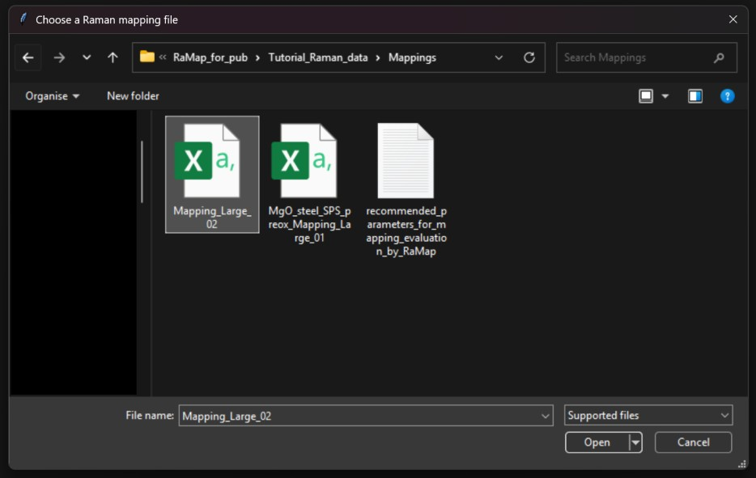<br>
    <em>Figure 1: File selection window for Raman mapping data.</em>
  </p>

  Further information regarding supported file formats and required data structures can be found in the [documentation](documentation.md#input-data-format-raman-mapping).

### Load Raman Reference Spectra

* Once the mapping dataset has been selected, a second window will appear for importing reference spectra.
In this step, select and open all reference files.

  <p align="center">
    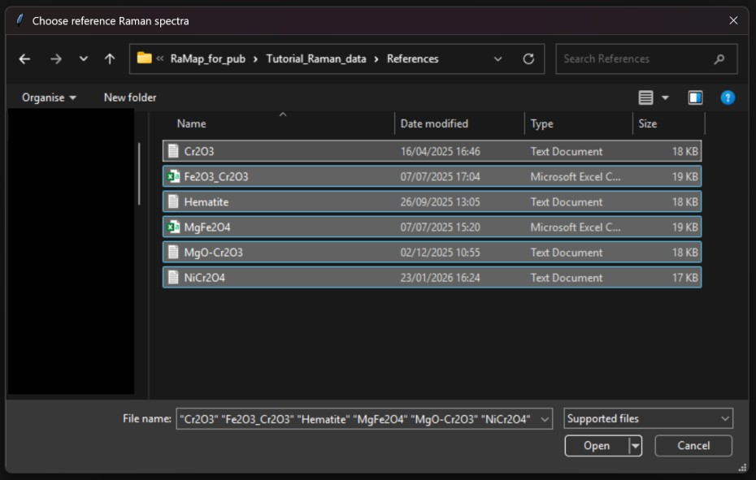<br>
    <em>Figure 2: File selection window for reference Raman spectra.</em>
  </p>

  Details on supported file formats are also provided in the [documentation](documentation.md#input-data-format-raman-spectra-for-reference-materials).


* After the reference data have been loaded, they can be assigned names in the terminal:
  ```
  File: path-to/Tutorial_Raman_data/References/Cr2O3.txt
  Compound name: chromiumoxide
  ```


* After confirming with ENTER, the chemical formula can be entered next. For this purpose, LaTeX notation should be used.
  ```
  File: path-to/Tutorial_Raman_data/References/Cr2O3.txt
  Compound name: chromiumoxide
  Chemical formula: \alpha -Cr_2O_3
  ```


* After confirming again with ENTER, a color can be assigned to this compound. 
  ```
  File: path-to/Tutorial_Raman_data/References/Cr2O3.txt
  Compound name: chromiumoxide
  Chemical formula: \alpha -Cr_2O_3
  Plot color (press Enter for system color): #D500D5
  ```
  >:bulb:  Only string values are supported for color selection. <br>
  >| Parameter | Type   | Example Values           | Description                                                             |
  >| --------- | ------ | ------------------------ | ----------------------------------------------------------------------- |
  >| Plot color| string | red, blue, #FF0000 | Defines the color using a string. See [Matplotlib documentation](https://matplotlib.org/stable/users/explain/colors/colors.html#color-formats) for more options. |

  Pressing ENTER without specifying a color assigns a default system color. By default, the [Set1](https://matplotlib.org/stable/users/explain/colors/colormaps.html#qualitative) color palette is used.
  
The assignment of `Compound`, `Chemical formula`, and `Plot color` is repeated for each reference spectrum.
For the dataset used in this tutorial, all inputs are summarized in the table below:

| File   | Compound           | Chemical formula     |     Plot color                                                 |
| --------- | ------ | ------------------------ | ----------------------------------------------------------------------- |
| Cr2O3.txt | Chromium oxide | \alpha -Cr_2O_3 | #D500D5 |
| Fe2O3_Cr2O3.csv | Ironchromite | FeCr_2O_4 | #5E3C99 |
| Hematite.txt | Hematite | \alpha -Fe_2O_3 | #9E0600 |
| MgFe2O4.csv | Magnesioferrite | MgFe_2O_4 | #008000 |
| MgO-Cr2O3.txt | Magnesiochromite | MgCr_2O_4 | #66CA7A |
| NiCr2O4.txt | Nickelchromite | NiCr_2O_4 | #EE7600 |
<br>

> :bulb: This internal database only needs to be created once. It is then automatically saved as a `.json` file in the same directory as the Raman mapping file (in our case under *dict_ref_Mapping_Large_02.json*).
> When the same mapping is processed again in the workflow, the system automatically accesses this JSON file and retrieves the required information.
> 
> If reference data changes (e.g., new entries are added or colors need to be updated), this can be done directly in the JSON file. Alternatively, the file can be removed from the directory, forcing it to be regenerated.
>
> If the JSON file is not found in the directory, the procedure must be repeated.

## 3 Display and save intermediate results?

* After successfully importing the Raman data, the following prompt appears in the terminal:
  ```
  Do you want to view and save intermediate results as .png images? (y/n): y
  ```

  RaMap provides the option to display and save *intermediate results* that are used for generating phase mappings. These results are briefly discussed in the steps 6 to 9 <br>
  If this option is confirmed with `y`, all intermediate images will be displayed and saved sequentially. They can be found in the folder `RaMap_results-Mapping_Large_02`, which is generated and located in the same directory as the Raman mapping file. <br>
  <br>
  If this option is answered with `n`, only the final phase maps will be generated and saved in `RaMap_results-Mapping_Large_02`.

## 4 Set the spatial unit of the mapping

* Next, you will be asked in which spatial unit the mappings were measured (e.g. mm, cm, etc.).  
  If the data was measured in micrometers, this prompt can simply be confirmed by pressing ENTER without entering any value.
  ```
  Please enter the units of the mapping.
  (Default is micrometer). Press Enter to use the default:
  ```
  In our example, the unit is micrometers, so we simply proceed by pressing ENTER.


## 5 Selecting the Region of Interest

* In this step, the region of the Raman spectrum containing usable signals can be selected.  
  To do this, the following prompt must be answered:
  ```
  Which wavenumber range should be considered? 
  Please enter the values in the format: minimum,maximum 160,1400
  ```
  In our example, we select the range between 160 cm<sup>-1</sup> to 1400 cm<sup>-1</sup>.

## 6 Display of the reference Raman spectra

* After the input is completed, the baseline-corrected and min-max normalized reference spectra are displayed sequentially.  
  These windows can be closed easily.  
  The spectra represent intermediate results and are saved in the folder `RaMap_results-Mapping_Large_02`.

  <p align="center">
    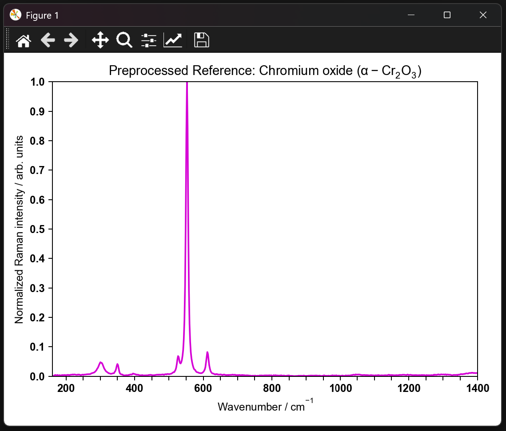<br>
    <em>Figure 3: Window to display reference Raman spectrum of chromoxide.</em>
  </p>

## 7 Setting threshold values

* Next, a prompt is started where the threshold for possible photoluminescence background (PL threshold) must be entered.
  ```
  Please enter a value for the PL threshold. (Set 0 if no PL should be considered):0.87
  ```

  In this example, a value of `0.87` is used for the PL threshold.  <br>
  
  This threshold is determined based on the influence of the baseline relative to the baseline-corrected Raman signal.  
  This means that, in this case, all spectra whose baseline, evaluated at the wavenumber position with the highest intensity in the spectrum, accounts for more than 87% of the total intensity are considered to be affected by photoluminescence (PL) and are      excluded from subsequent analysis.  <br>
  
  More detailed information will follow.
  
* Next, a threshold for the signal-to-noise ratio (SNR) is requested.
  ```
  Please enter a value for the SNR threshold:3
  ```

  Here, we use a value of `3`, which corresponds to an accepted rule of thumb.  <br>
  
  More detailed information will follow.
<br>
  > :bulb: Guidance on threshold values for the two example mappings *MgO_steel_SPS_preox_Mapping_Large_01.csv* and *Mapping_Large_02.csv* is provided in a [TXT](./Tutorial_Raman_data/Mappings/recommended_parameters_for_mapping_evaluation_by_RaMap.txt) file.
<br>

* A window now opens showing all measurement positions, with an indication of whether the spectrum at each position will be used (*good positions*) or excluded due to a poor SNR or strong PL background. This is an intermediate result and is saved in the folder `RaMap_results-Mapping_Large_02`.

  <p align="center">
    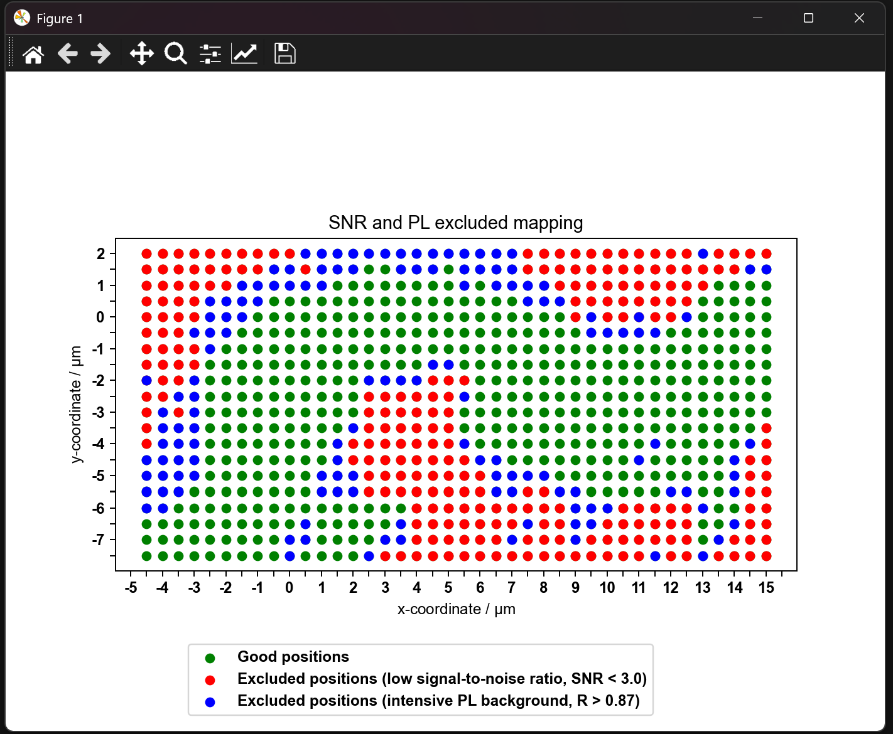<br>
    <em>Figure 4: Illustration indicating which measurement positions in the mapping are included and which are excluded.</em>
  </p>
  <br>
  
  In addition, a file called `Excluded_spectra.txt` is created in the folder `RaMap_results-Mapping_Large_02`, collecting all excluded spectra for later review in external programms.
  
## 8 Intermediate images

If the prompt from Step 3 was answered with `y`, additional intermediate results are now displayed, resulting from the Raman data analysis using Non-negative Factorization or Cosine similarity. All figures will be saved in the folder `RaMap_results-Mapping_Large_02`    
Further information on this will follow.

### Non-negative Factorization

<p align="center">
  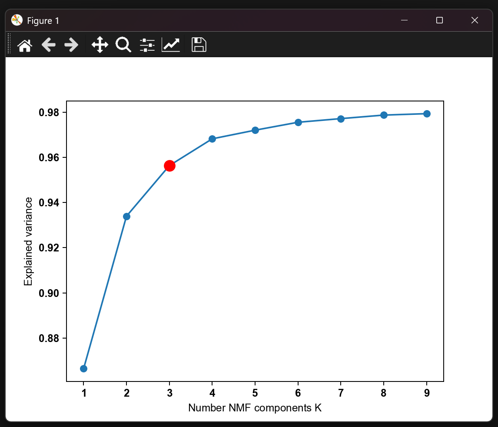<br>
  <em>Figure 5: This figure shows the optimal number of components for the Non-negative Factorization decomposition.  
This is based on the elbow algorithm, which is automatically executed in the background.</em>
</p>

<br>

<p align="center">
  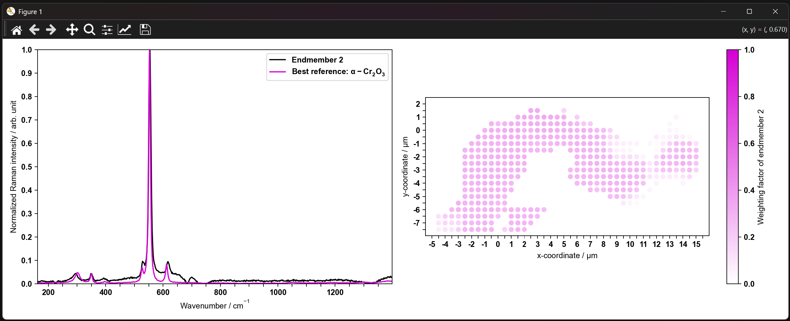<br>
  <em>Figure 6: The following windows shows the results of the Non-negative Factorization decomposition. Here, one of the identified phases, chromium oxide, is displayed as an example.</em>
</p>

<br>

<p align="center">
  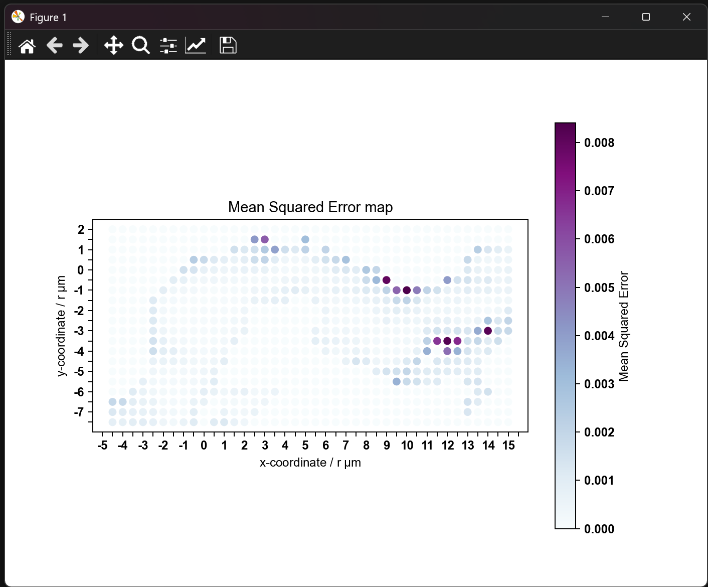<br>
  <em>Figure 7: The Mean Squared Error between the Non-negative Factorization model and the measured Raman spectra per spatial measurment position.</em>
</p>

### Cosine Similarity

<p align="center">
  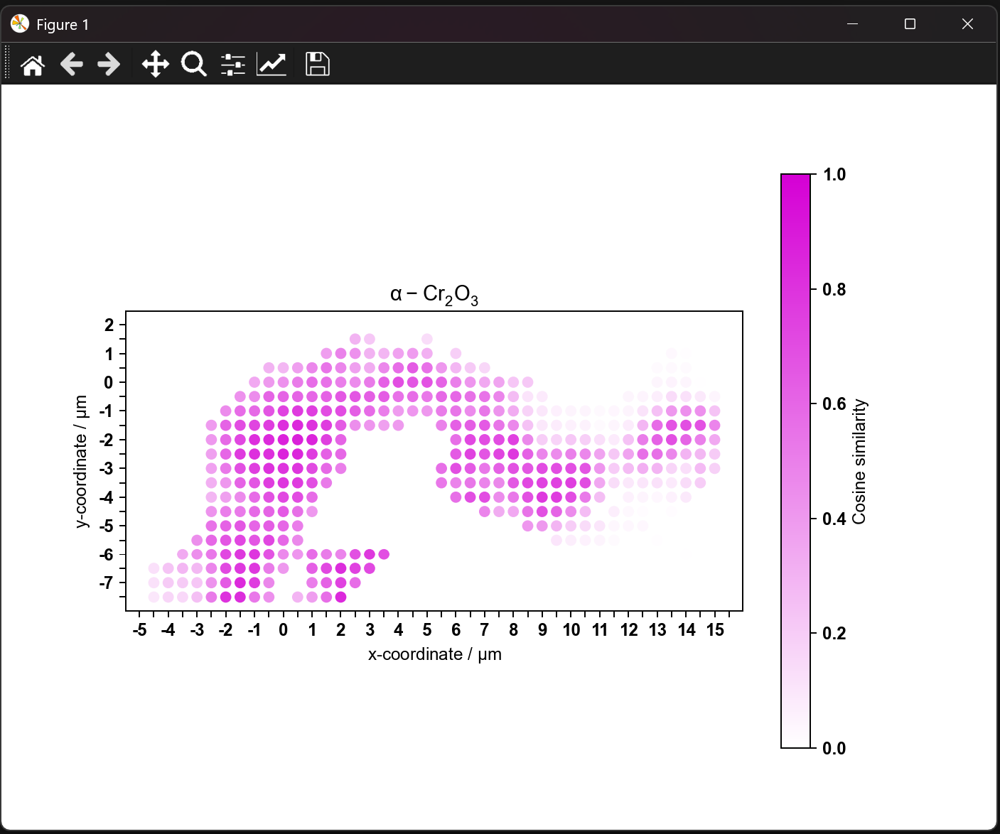<br>
  <em>Figure 8: The calculated Cosine Similarity between the reference Raman spectrum of chromium oxide and the measured Raman spectrum per spatial measurement point.</em>
</p>

This figure will be displayed for each of the stored reference phases.
<br>

<p align="center">
  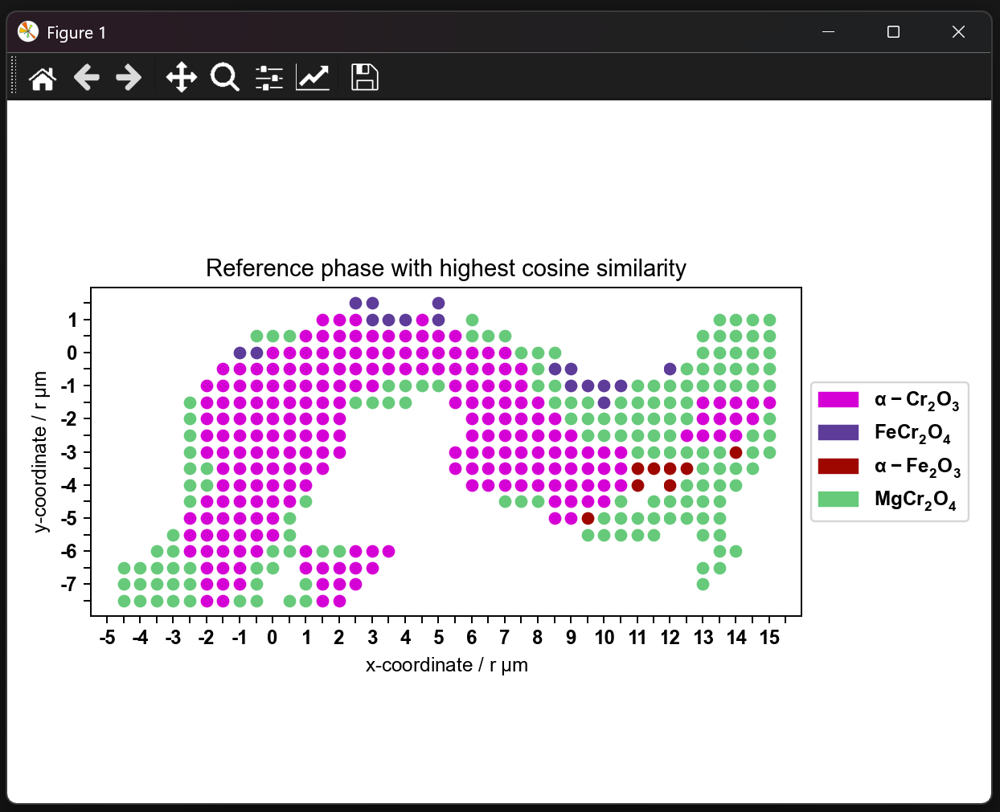<br>
  <em>Figure 9: This shows the phases that have the highest cosine similarity with the corresponding measured spectrum at each measurement point.</em>
</p>

## 9 Combination of Non-negative Matrix Factorization and Cosine Similarity into a Combined Score

The core aspect of RaMap is that the results from NMF and cosine similarity are combined to calculate a *Combined Score*, which is displayed for each phase from the database. This combined score is then used to construct phase mappings, visualizing the spatial distribution of the score and providing a measure of the likelihood that a phase is positively assigned.  <br>
Since both Non-negative Matrix Factorization and Cosine Similarity have their weaknesses and artifacts may occur in the result interpretation, the phase identifications from both methods are first compared. If a phase is found by only one of the methods, this is considered an inconsistency, and the corresponding spectra are excluded from the phase mapping. <br>  
These excluded spectra are then saved in the file `Inconsitency_spectra.txt` within the folder `RaMap_results-Mapping_Large_02` for later review. <br>
<br>
Next, the calculated Combined Scores are computed for each retained phase, and their spatial distribution at each measurement point is displayed.

<p align="center">
  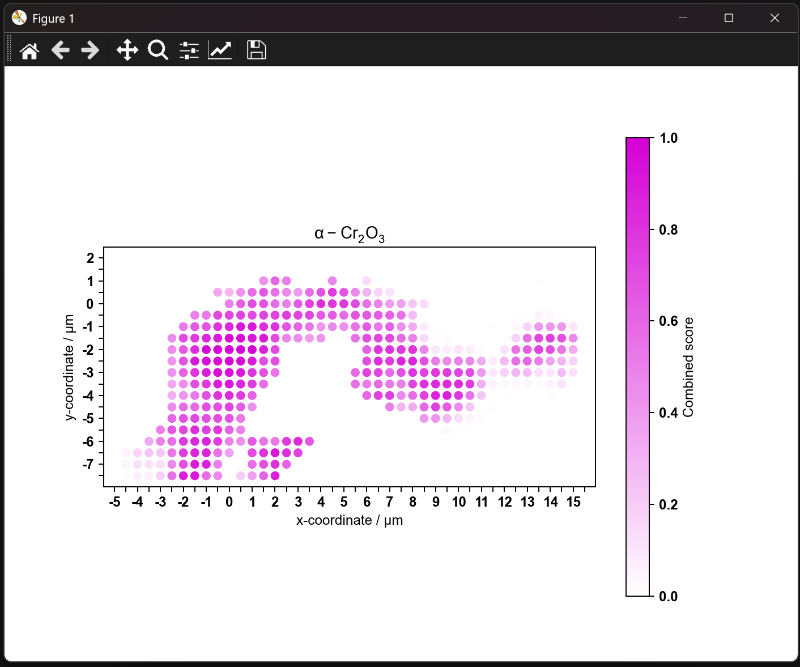<br>
  <em>Figure 9: The calculated Combined Score for the assigned phase chromium oxide per spatial measurement point.</em>
</p>

## 10 Generation of the phase mappings
Finally, the generated phase mappings are displayed and saved in the folder `RaMap_results-Mapping_Large_02`.  
These mappings are created based on the Combined Score, and a smoothing algorithm is applied to generate a continuous spatial distribution.

<p align="center">
  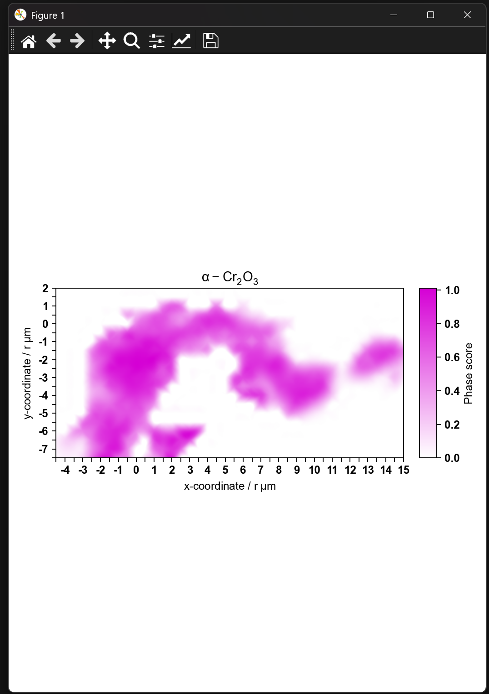<br>
  <em>Figure 10: The generated phase map of chromium oxide.</em>
</p>
